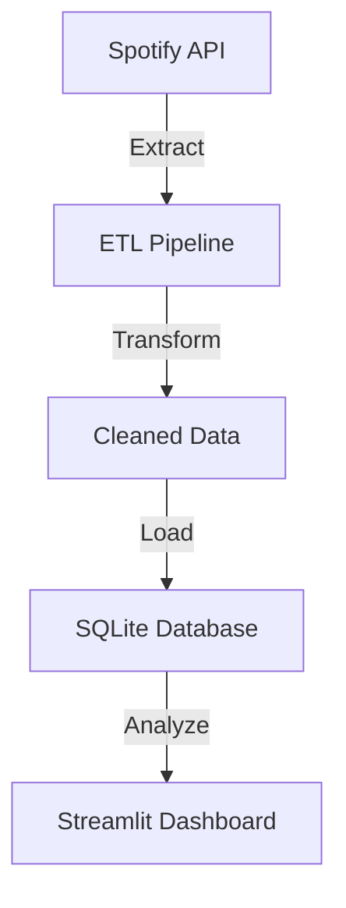

# 🎵 Spotify ETL Pipeline (Local Deployment with Docker & Streamlit) 🚀

## 📌 Project Overview

This project is an **end-to-end ETL (Extract, Transform, Load) pipeline** that fetches a user's **recently played tracks from Spotify**, processes the data, and stores it in a **SQLite database**. The project also includes **data analysis using Streamlit** to visualize listening trends.


---

## ⚙️ Project Architecture


---

## 🛠️ Tech Stack

- 🐍 **Python 3.10**
- 🎵 **Spotify API** (OAuth2 Authentication, Data Extraction)
- 📊 **Pandas** (Data Processing)
- 🗄️ **SQLite** (Local Database Storage)
- 📈 **Streamlit** (Data Visualization)
- 🐳 **Docker** (Containerization for easy deployment)

---

## 🚀 How to Run the Project

### 1️⃣ Clone the Repository 🛠️
```bash
git clone https://github.com/YOUR_GITHUB_USERNAME/spotify-llm-etl.git
cd spotify-llm-etl
```
### 2️⃣ Set Up a Virtual Environment 🏗️
```bash
python3 -m venv venv
source venv/bin/activate
```
### 3️⃣ Install Dependencies 📦
```bash
pip install -r requirements.txt
```
### 4️⃣ Set Up Your Spotify API Credentials 🔑

1. Go to [Spotify Developer Dashboard](https://developer.spotify.com/dashboard)
2. Create a new application and get **Client ID** and **Client Secret**.
3. Add `http://localhost:8888/callback` as the Redirect URI.
4. Create a .env file and add your credentials:
   ini
   SPOTIFY_CLIENT_ID=your_client_id
   SPOTIFY_CLIENT_SECRET=your_client_secret
   
### 5️⃣ Run the ETL Pipeline to Fetch Data ⏳
```bash
PYTHONPATH=$(pwd) python spotify_pipeline/pipelines/fetch_recent_tracks.py
```
✅ **This will fetch recent tracks and store them in the database.**

### 6️⃣ Run the Streamlit Dashboard 🎨
```bash
streamlit run spotify_pipeline/visualization/streamlit_app.py
```
✅ **Opens an interactive web dashboard to explore the data.**

---

## 🐳 Running with Docker

### 1️⃣ Build the Docker Image 🏗️
```bash
docker build -t spotify-etl .
```
### 2️⃣ Run the Docker Container 🚀
```bash
docker run -p 8501:8501 spotify-etl
```
✅ **This will start the ETL pipeline and Streamlit dashboard inside a container.**

---

## 📊 Features & Data Insights

- 🎧 **Fetch Recently Played Tracks** (Spotify API)
- 🗃️ **Store & Process Data** (SQLite + Pandas)
- 🔍 **Data Cleaning & Transformation**
- 📊 **Basic Listening Trends Analysis**
- 🎨 **Visualize Data using Streamlit**

---

## 🛠️ Future Improvements

- 🔹 **Migrate to PostgreSQL for cloud storage**
- 🔹 **Extend ETL with LLM-based sentiment analysis**
- 🔹 **Deploy fully to AWS for cloud-based analytics**

---

## 📄 License 📝

This project is open-source and available under the **MIT License**.

---

## 💡 Contributing 🤝

Feel free to open issues or submit PRs to improve the project!

🚀 **Happy Coding!** 🎶