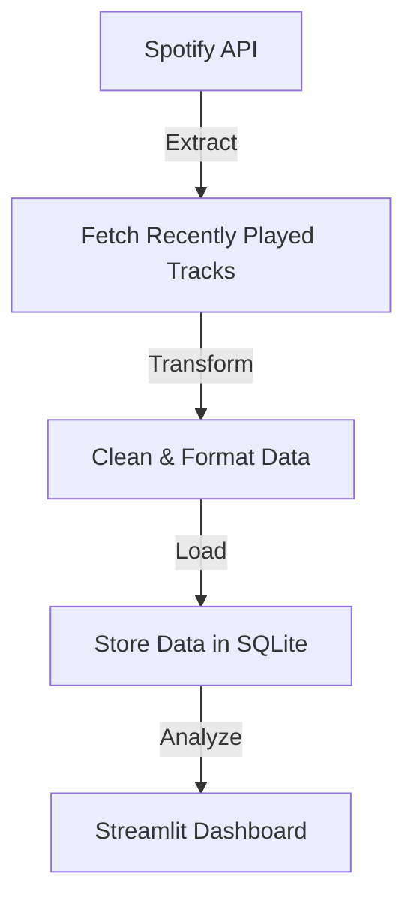

# **🔄 Spotify ETL Pipeline Documentation**

## **📌 Overview**

The **Spotify ETL Pipeline** extracts, transforms, and loads recently played track data from **Spotify's API** into a **SQLite database** for analysis. This document explains the ETL process in detail.

---

## **⚙️ ETL Workflow**


---

## **🛠️ Technologies Used**

- **Python 3.10** – Core programming language
- **Spotify API** – Data source
- **Pandas** – Data processing
- **SQLite** – Database storage
- **Streamlit** – Data visualization

---

## **📥 1️⃣ Extract Phase**

### **Fetching Recently Played Tracks from Spotify API**

The pipeline fetches the last **50 played songs** using Spotify's \\ endpoint.

🔹 **Key considerations:**

- Uses **OAuth2 authentication** to access user data.
- Handles **pagination** to fetch up to **10,000 songs**.
- Saves data in a structured format (JSON → DataFrame).

✅ **Extract Code (fetch\_recent\_tracks.py):**
```python
spotify_data = SpotifyData()
df = spotify_data.get_recently_played(limit=50)
```
---

## **🔄 2️⃣ Transform Phase**

### **Cleaning & Formatting Data**

The pipeline **transforms** the raw JSON data into a structured Pandas **DataFrame**.

🔹 **Transformations performed:**

- Extracts **track name, artist, album, and timestamp**.
- Removes **duplicate records** (same track played multiple times).
- Ensures **timestamps are in UTC format**.

✅ **Transform Code (spotify\_data.py):**
```python
df = pd.DataFrame(track_data)
df.drop_duplicates(subset=["track_id", "played_at"], inplace=True)
```
---

## **💾 3️⃣ Load Phase**

### **Saving Data to SQLite Database**

Once the data is cleaned, it is **inserted into SQLite**.

🔹 **Database Schema:**
```sql
CREATE TABLE tracks (
    track_id TEXT PRIMARY KEY,
    track_name TEXT,
    artist_name TEXT,
    album_name TEXT,
    played_at TEXT PRIMARY KEY
);
```
✅ **Load Code (spotify\_data.py):**
```python
session = SessionLocal()
session.merge(Track(
    id=row["track_id"],
    name=row["track_name"],
    artist=row["artist_name"],
    album=row["album_name"],
    played_at=row["played_at"]
))
session.commit()
```
---

## **📊 Next Steps**

✅ **Streamlit Dashboard** for visualizing user listening habits.
✅ **Dockerization** for portability.
🔹 **Move to PostgreSQL** for scalable storage.
🔹 **Integrate AI-based music recommendations.**

---

## **📄 Summary**

The **Spotify ETL pipeline** successfully extracts, transforms, and loads Spotify track data into SQLite, ensuring **clean and structured data** for further analysis.